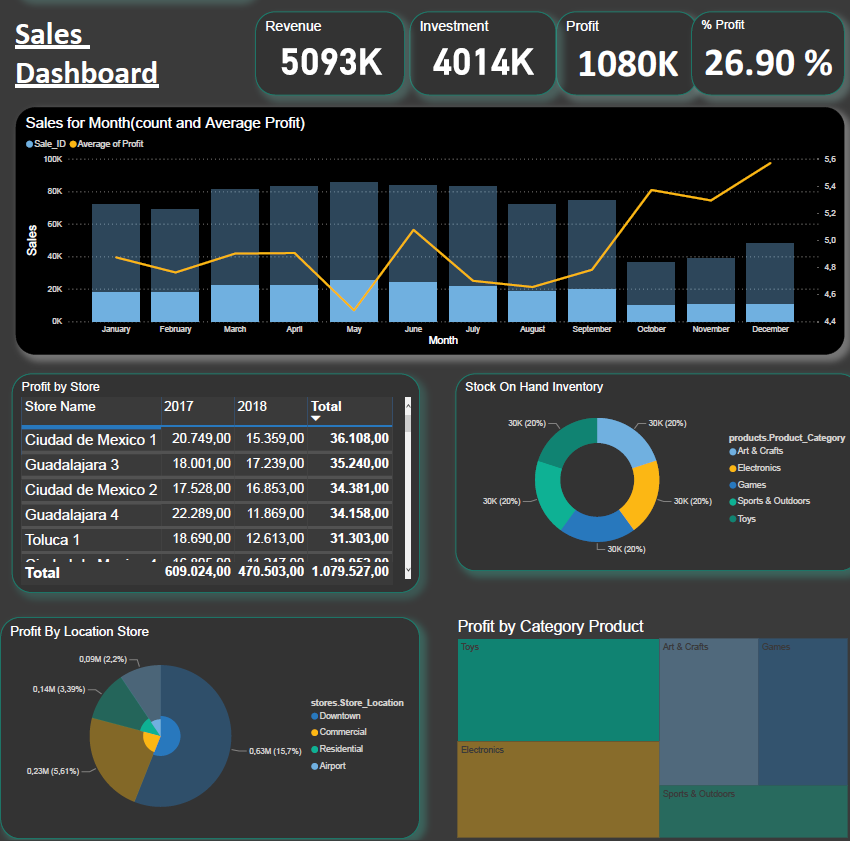

# Maven_Toys

Sales report:
- Data analysis: python
- Dahsboard : Power BI

## Conclusions
#### Between October and January, the number of purchases is lower but much higher in amount:
In the bar chart it can be seen that the largest number of sales occur between March and September, however the line that represents the average indicates that the highest performance is usually between October and January (holiday months)

#### Profit by Location Store 
Stores in small cities tend to have the best profit, followed by commercial areas and in third place residential areas

#### Profit by Products
Toys and electronic devices are the best returns product categories offered to the business.

